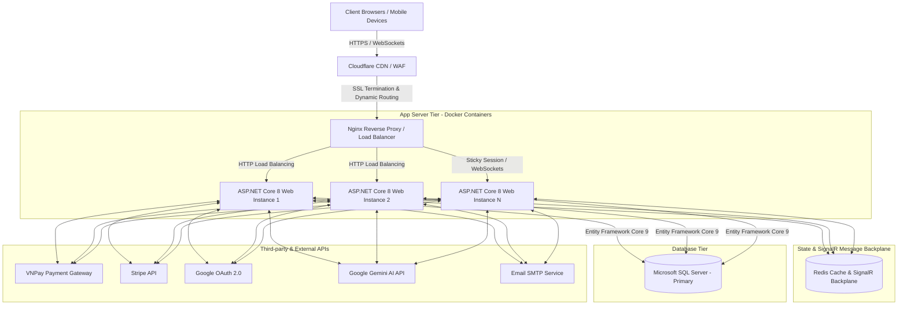

# 3.6. Triển khai và mở rộng hệ thống thương mại điện tử

Trong bối cảnh các hệ thống thương mại điện tử đặt vé xem phim trực tuyến (Cinezone) thường xuyên phải đối mặt với lưu lượng truy cập đột biến (đặc biệt là vào các khung giờ mở bán vé phim chiếu rấp "hot" hoặc các dịp lễ, cuối tuần), việc thiết kế một kiến trúc triển khai linh hoạt, có khả năng mở rộng (Scalability), sẵn sàng cao (High Availability) và hạ tầng tự động hóa (CI/CD) đóng vai trò sống còn.

---

### 3.6.1. Kiến trúc triển khai (Deployment Architecture)

Hệ thống Cinezone được thiết kế theo mô hình **Kiến trúc đa tầng (Multi-tier Architecture)** kết hợp với mô hình **Containerized Application**, tách biệt rõ ràng giữa lớp xử lý giao diện/logic dịch vụ, lớp truyền thông thời gian thực và lớp lưu trữ dữ liệu.

**Mô tả chi tiết các thành phần trong kiến trúc triển khai:**
1. **Lớp Giao diện & Điều hướng (Client & CDN/Load Balancer):**
   - **Cloudflare / Nginx Reverse Proxy:** Nhận request HTTPS từ người dùng, thực hiện giải mã SSL/TLS (SSL Termination), chống tấn công DDoS, caching tài nguyên tĩnh (`wwwroot`: CSS, JS, hình ảnh poster) và điều hướng tải đến các instance ứng dụng.
2. **Lớp Ứng dụng (App Server Tier - ASP.NET Core 8):**
   - Đóng gói ứng dụng Cinezone thành các **Docker Containers** chạy trên môi trường .NET 8 runtime.
   - Xử lý toàn bộ Business Logic: Quản lý phim, lịch chiếu, tính toán Voucher/Khuyến mãi, tạo đơn đặt vé.
   - Duy trì giao tiếp thời gian thực qua **ASP.NET Core SignalR (`ChatHub`, `GroupBookingHub`)** giúp đồng bộ trạng thái chọn ghế theo thời gian thực giữa nhiều người dùng.
3. **Lớp Lưu trữ Trạng thái & Cache (State & SignalR Backplane):**
   - Sử dụng **Redis Distributed Cache** để lưu trữ Session người dùng và làm Redis Backplane đồng bộ thông điệp WebSocket của SignalR khi mở rộng ra nhiều Web Server instance.
4. **Lớp Cơ sở dữ liệu (Database Tier - SQL Server):**
   - Hệ quản trị CSDL **Microsoft SQL Server** quản lý dữ liệu giao dịch đặt vé, tài khoản, thông tin phim và lịch chiếu qua **Entity Framework Core 9.0**.
5. **Lớp Dịch vụ bên ngoài (External APIs Integration):**
   - Tích hợp cổng thanh toán trực tuyến: **VNPay** và **Stripe.net**.
   - Tích hợp xác thực **Google OAuth 2.0** và dịch vụ trí tuệ nhân tạo **Google Gemini API** (hỗ trợ gợi ý phim và phân nhóm khách hàng).

---

### 3.6.2. Cloud Deployment (Hoặc Free Hosting)

Để đưa hệ thống Cinezone lên môi trường Internet, giải pháp triển khai được linh hoạt tùy thuộc vào quy mô và chi phí vận hành:

#### 1. Phương án Triển khai trên Điện toán Đám mây (Cloud Deployment - Microsoft Azure / AWS)
*Đây là phương án tiêu chuẩn dành cho môi trường sản phẩm (Production).*
- **Web Application Hosting:** Triển khai ASP.NET Core Web App trên **Azure App Service (Linux/Docker container)** hoặc **AWS Elastic Beanstalk**. Azure hỗ trợ tối đa cho hệ sinh thái .NET 8, tự động quản lý chứng chỉ SSL và tích hợp sẵn công cụ giám sát Application Insights.
- **Database Hosting:** Sử dụng **Azure SQL Database** (PaaS) cung cấp khả năng tự động sao lưu (Automated Backup), khôi phục dữ liệu theo mốc thời gian (Point-in-time Restore) và độ sẵn sàng 99.99%.
- **File Storage:** Sử dụng **Azure Blob Storage** để lưu trữ hình ảnh poster phim, banner truyền thông và ảnh đại diện người dùng thay vì lưu trực tiếp trong thư mục `wwwroot`.
- **Cấu hình biến môi trường (Environment Variables):** Bảo mật các thông số nhạy cảm qua **Azure Key Vault** hoặc cấu hình App Settings:
  - `ConnectionStrings__CinemaDb`: Chuỗi kết nối SQL Server mã hóa.
  - `Stripe__SecretKey`, `VNPAY__HashSecret`: Secret Key thanh toán.
  - `Gemini__ApiKey`: Khóa kết nối API AI.

#### 2. Phương án Triển khai Môi trường Thử nghiệm / Demo (Free & Budget Hosting)
*Dành cho mục đích thử nghiệm, nghiệm thu đồ án với chi phí 0 VNĐ:*
- **Backend & Web Hosting:** Triển khai Docker image ứng dụng Cinezone lên **Render.com** (Free Web Service) hoặc **Railway.app** / **SmarterASP.NET** (cho phép host ứng dụng ASP.NET Core miễn phí / chi phí rất thấp).
- **Database Hosting:** Sử dụng dịch vụ **SmarterASP.NET SQL Server Free Trial** hoặc tạo instance **SQL Server 2022 Express** trên Cloud VPS miễn phí (như Oracle Cloud Free Tier).
- **SSL/TLS Certificate:** Sử dụng chứng chỉ SSL miễn phí từ **Let's Encrypt** tích hợp qua Cloudflare.

---

### 3.6.3. Auto Scaling (Tự động mở rộng hệ thống)

Nhằm đảm bảo hệ thống Cinezone luôn hoạt động ổn định kể cả khi lượng người dùng truy cập tăng đột biến trong các dịp công chiếu phim bom tấn, giải pháp **Auto Scaling** được áp dụng linh hoạt:

#### 1. Mở rộng chiều ngang (Horizontal Scaling / Scale-out) & Mở rộng chiều dọc (Vertical Scaling / Scale-up)
- **Scale-out (App Server):** Tự động tăng số lượng container/instance chạy ứng dụng ASP.NET Core từ 2 instance ban đầu lên tối đa 10 instance khi tải tăng cao, và tự động thu hồi khi tải giảm.
- **Scale-up (Database Server):** Tăng dung lượng RAM, vCPU và IOPS cho máy chủ SQL Server để đáp ứng tần suất ghi/đọc giao dịch lớn.

#### 2. Chiến lược & Ngưỡng kích hoạt Auto Scaling (Metrics & Triggers)
Tích hợp luật mở rộng tự động trên Cloud (Azure Autoscale / Kubernetes HPA):
- **CPU Threshold:** Tự động **Scale-out (+1 instance)** khi mức sử dụng CPU bình quân của các Web App Server vượt quá **75%** liên tục trong 5 phút.
- **Memory Threshold:** Tự động tăng instance khi RAM vượt quá **80%**.
- **Request Queue / Connection:** Tự động tăng instance khi số lượng kết nối đồng thời (Concurrent Requests / SignalR WebSockets) vượt quá ngưỡng **1.000 connections/node**.
- **Scheduled Scaling (Mở rộng theo lịch trình):** Cấu hình chủ động tăng số lượng instance trước các khung giờ cao điểm cố định (ví dụ: từ 18:00 - 22:00 các ngày Thứ Sáu, Thứ Bảy và Chủ Nhật).

#### 3. Giải pháp xử lý trạng thái khi Scale-out (State Management in Scaled Environment)
Khi hệ thống chạy trên nhiều instance, vấn đề đồng bộ trạng thái được giải quyết triệt để:
- **Đồng bộ Session người dùng:** Chuyển đổi từ `AddDistributedMemoryCache()` cục bộ sang **Redis Distributed Cache** (`Microsoft.Extensions.Caching.StackExchangeRedis`). Nhờ đó, bất kỳ instance Web nào nhận request đều có thể truy xuất Session đặt vé của khách hàng mà không bị đứt gãy.
- **Mở rộng kết nối SignalR (Redis SignalR Backplane):** Cấu hình `AddSignalR().AddStackExchangeRedis()` để khi người dùng ở Instance A thực hiện chọn ghế thời gian thực, thông điệp sẽ được pub/sub qua Redis và broadcast đến toàn bộ người dùng đang xem sơ đồ ghế ở Instance B, C.

---

### 3.6.4. Continuous Integration and Continuous Deployment (CI/CD)

Quy trình CI/CD tự động hóa toàn bộ vòng đời phát triển phần mềm dự án Cinezone thông qua công cụ **GitHub Actions** (hoặc Azure DevOps Pipelines), loại bỏ các rủi ro từ việc triển khai thủ công.

```mermaid
flowchart LR
    A[Developer Push Code / PR] --> B[GitHub Repository]
    
    subgraph CI_Stage [Continuous Integration]
        B --> C[Trigger Workflow]
        C --> D[Restore NuGet Packages]
        D --> E[Build Solution - dotnet build]
        E --> F[Run Unit & Integration Tests]
        F --> G[Code Analysis & SonarQube Lint]
    end

    CI_Stage -- Pass --> CD_Stage

    subgraph CD_Stage [Continuous Deployment]
        G --> H[Build Docker Image]
        H --> I[Push Image to Docker Hub / ACR]
        I --> J[Deploy to Staging / Production]
        J --> K[Health Check /health]
    end

    K -- Success --> L[Deployment Complete & Tag Version]
    K -- Fail --> M[Trigger Auto-Rollback to Previous Image]
```

#### 1. Build tự động (Automated Build)
- Khi nhà phát triển đẩy mã nguồn (`push`) hoặc tạo yêu cầu hợp nhất (`Pull Request`) vào nhánh `main` hoặc `develop`:
  - Pipeline tự động khởi chạy môi trường runner (Ubuntu/Windows Container).
  - Tải về và khôi phục các gói phụ thuộc: `dotnet restore`.
  - Biên dịch toàn bộ Solution: `dotnet build --configuration Release --no-restore`.
  - Đóng gói ứng dụng thành Docker Container Image: `docker build -t cinezone:v1.x.x .`.

#### 2. Test tự động (Automated Test)
- Ngay sau bước Build thành công, hệ thống tự động thực thi các bộ kiểm thử:
  - **Unit Tests:** Kiểm thử các hàm tính toán giá vé, áp dụng mã giảm giá (Voucher Condition Rules), mã hóa mật khẩu (`BCrypt`).
  - **Integration Tests:** Kiểm thử tích hợp kết nối CSDL và các Endpoint API controller.
  - Sử dụng lệnh: `dotnet test --no-build --verbosity normal`.
  - **Điều kiện chặn (Gate):** Nếu có bất kỳ testcase nào thất bại (Failed), quy trình CI lập tức dừng lại, gửi thông báo cảnh báo qua Email/Slack cho nhóm phát triển và **chặn không cho phép merge code**.

#### 3. Deploy tự động (Automated Deployment)
- Khi code đã pass toàn bộ các bước Test và được Merge vào nhánh `main`:
  - Docker Image sẽ được gán tag phiên bản chính thức và push lên **Docker Hub** hoặc **Azure Container Registry (ACR)**.
  - Pipeline gửi tín hiệu (Webhook / SSH Key / Azure Deploy Action) để máy chủ Production cập nhật ứng dụng.
  - Áp dụng kỹ thuật **Blue/Green Deployment** hoặc **Rolling Update**: Khởi chạy container mới bên cạnh container cũ, điều hướng lưu lượng truy cập dần dần sang container mới mà **không gây ngắt kết nối hệ thống (Zero Downtime Deployment)**.

#### 4. Rollback khi có lỗi (Automated & Manual Rollback)
- **Health Check Endpoint:** Ứng dụng ASP.NET Core cung cấp Endpoint `/health` kiểm tra tình trạng sống/khỏe của App và kết nối SQL Server.
- **Tự động Rollback (Auto-Rollback):** Trong quá trình Deploy, nếu container mới khởi chạy thất bại (Crash) hoặc Endpoint `/health` trả về lỗi HTTP 5xx sau 3 lần thử (retry), hệ thống sẽ tự động hủy đợt deploy và khôi phục lưu lượng mạng về phiên bản container stable gần nhất.
- **Rollback thủ công:** Cho phép Quản trị viên kích hoạt khôi phục về bất kỳ Docker Image Tag nào trước đó chỉ bằng 1-Click trên giao diện GitHub Actions / Azure Portal.

#### 5. Quản lý phiên bản (Version Management)
- **Chuẩn đánh mã phiên bản (Semantic Versioning - SemVer):**
  - Định dạng: `MAJOR.MINOR.PATCH` (Ví dụ: `v1.2.0`).
    - `MAJOR`: Thay đổi lớn, nâng cấp kiến trúc hoặc phá vỡ tính tương thích cũ.
    - `MINOR`: Thêm tính năng mới (như tích hợp thêm cổng thanh toán mới, AI recommendation).
    - `PATCH`: Sửa lỗi nhỏ (Bug fixes, hotfix).
- **Chiến lược phân nhánh Git (Git Flow Strategy):**
  - Nhánh `main`: Chứa mã nguồn ổn định nhất đang chạy trên môi trường Production.
  - Nhánh `develop`: Nhánh tích hợp dữ liệu để kiểm thử trên môi trường Staging.
  - Các nhánh `feature/*`: Phát triển các tính năng riêng biệt (ví dụ: `feature/vnpay-payment`, `feature/signalr-chat`).
  - Các nhánh `hotfix/*`: Trát lỗi khẩn cấp trực tiếp cho Production.
- **Quản lý cấu hình theo môi trường (Multi-Environment Configuration):**
  - Tách biệt file cấu hình giữa các môi trường: `appsettings.Development.json`, `appsettings.Staging.json`, `appsettings.Production.json`. Các chuỗi kết nối và API Key của môi trường Production được lưu trữ an toàn trong biến môi trường hệ thống (Environment Variables) hoặc CI/CD Secrets.

---

### Tổng kết
Việc hoạch định kiến trúc triển khai đa tầng kết hợp với công nghệ Container hóa (Docker), cơ chế mở rộng linh hoạt (Auto Scaling với Redis Backplane) và quy trình CI/CD tự động hóa toàn diện giúp hệ thống đặt vé xem phim **Cinezone** đạt được độ tin cậy cao, vận hành mượt mà dưới tải lớn, đồng thời tối ưu hóa thời gian đưa sản phẩm mới ra thị trường (Time-to-Market).
